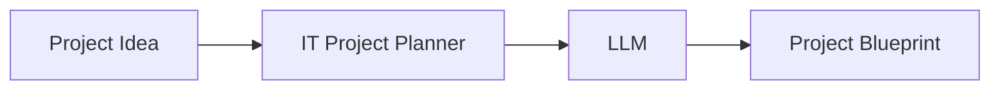
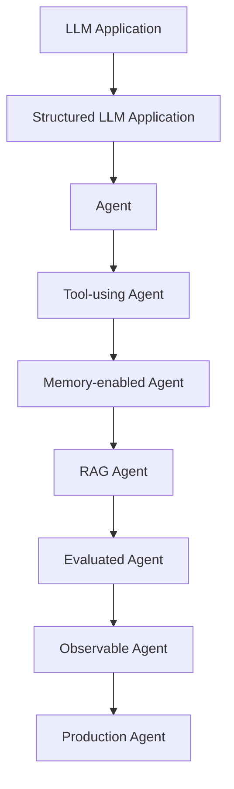

# IT Project Planner Agent

Turn a rough IT project idea into a structured technical blueprint.

Input:

> "I want to build an AI chatbot for company documents."

Output — a blueprint with project name, description, business problem, functional and non-functional requirements, technology stack, and implementation plan.

## How it works

## Timeline

## Status

**Phase 8 — Tools is in progress**: phases 1–7 are complete (M1, M2, M3). The agent runtime has a loop, LLM-driven action selection, a max-iteration guard, and now executes the selected action through a `ToolRegistry` — blueprint generation is registered as a tool, and the agent provides its arguments in structured form. This is a learning project: at each step we define what we build, why, the code, how to test it, and what failure modes to watch for. The project deliberately starts as a plain LLM application and evolves toward a production agent.

## Docs

- [Product Requirements](docs/PRD.md)
- [Roadmap](docs/ROADMAP.md)
- [Session Handoff](docs/SESSION_HANDOFF.md)

## Planned Stack

| Component | Technology |
| --- | --- |
| Language | Python |
| Package manager | uv |
| Validation | Pydantic |
| LLM | OpenRouter |
| HTTP | httpx |
| Testing | pytest |
| Configuration | YAML + .env |
| UI / API / DB / RAG | Later |

## Roadmap (summary)

| Phase | Milestone |
| --- | --- |
| 1–2 | Product definition, project setup |
| 3 | LLM client — idea in, project name out |
| 4–6 | Prompts, structured output, full blueprint |
| 7 | Agent loop | Introduce a loop: analyze idea → decide what is needed → call LLM → check result → iterate; move from single-shot LLM application to an agent runtime; execute the selected action and feed the outcome back into `state` so the agent can complete (`finish`) |
| 8 | Tools | Give the agent tools (web search, files); tool-calling loop and structured tool requests |
| 9–10 | Memory, RAG | Short/long-term memory; ground blueprint generation with the existing `rag-system` |
| 11–13 | Guardrails, evaluation, observability |
| 14–18 | API, UI, Docker, CI/CD, production |

**Progress: phases 1–7 complete (M1–M3); phase 8 (tools) in progress.**