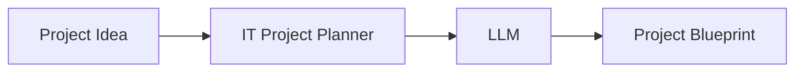
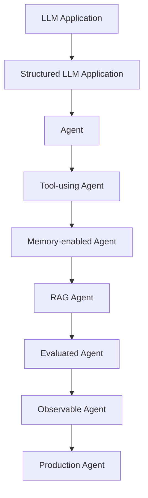

# IT Project Planner Agent

Turn a rough IT project idea into a structured technical blueprint.

Input:

> "I want to build an AI chatbot for company documents."

Output — a blueprint with project name, description, business problem, functional and non-functional requirements, technology stack, and implementation plan.

## How it works

## Timeline

## Status

**Phase 7 — Agent Loop is in progress**: phases 1–6 (M1 + M2) are complete, and the agent runtime now has a loop, LLM-driven action selection, and a max-iteration guard. This is a learning project: at each step we define what we build, why, the code, how to test it, and what failure modes to watch for. The project deliberately starts as a plain LLM application and evolves toward a production agent.

## Docs

- [Product Requirements](docs/PRD.md)
- [Roadmap](docs/ROADMAP.md)
- [Session Handoff](docs/SESSION_HANDOFF.md)

## Planned Stack

| Component | Technology |
| --- | --- |
| Language | Python |
| Package manager | uv |
| Validation | Pydantic |
| LLM | OpenRouter |
| HTTP | httpx |
| Testing | pytest |
| Configuration | YAML + .env |
| UI / API / DB / RAG | Later |

## Roadmap (summary)

| Phase | Milestone |
| --- | --- |
| 1–2 | Product definition, project setup |
| 3 | LLM client — idea in, project name out |
| 4–6 | Prompts, structured output, full blueprint |
| 7–10 | Agent loop, tools, memory, RAG |
| 11–13 | Guardrails, evaluation, observability |
| 14–18 | API, UI, Docker, CI/CD, production |

**Progress: phases 1–6 complete (M1 + M2); phase 7 (agent loop) in progress.**