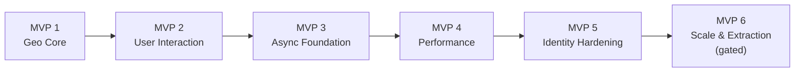
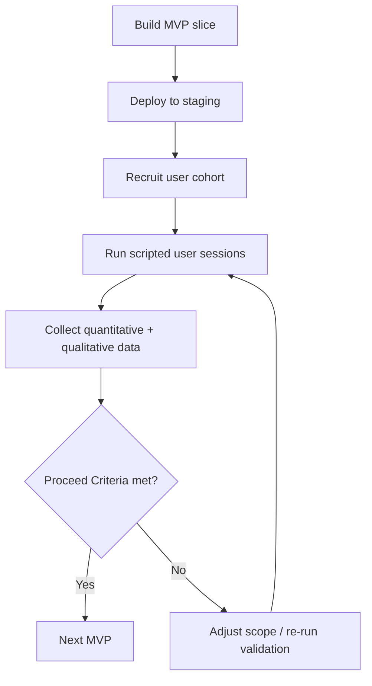

# BorneMap — Global Roadmap & Iterative Validation Plan

**Version:** 1.0.0
**Scope:** Cross-MVP roadmap for the BorneMap platform.
**Companions:** [`constitution.md`](./constitution.md), [`architecture.md`](./architecture.md).
**Per-MVP specs:** `specs/001-mvp1-geo-core/` … `specs/006-mvp6-scale/`.

> This file is the **global plan**. Each MVP has its own Speckit feature spec under `specs/`. Cheap LLM implementers should:
>
> 1. Read this file end-to-end.
> 2. Read the relevant `specs/00X-mvpN/spec.md`.
> 3. Run `/speckit.plan` and `/speckit.tasks` for that MVP.
> 4. Implement only what the resulting `tasks.md` lists.
> 5. Stop at the MVP boundary, run real-user validation, and wait for proceed/kill decision.

---

## 0. Roadmap at a Glance



Each arrow above is a **validation gate**: the next MVP starts only after the previous MVP's real-user validation report passes the documented Proceed Criteria.



---

## 1. How An MVP Is Run (Standard Operating Procedure)

Every MVP follows the same loop. The cheap LLM implementer does steps 1–4; humans run steps 5–7.

| Step | Owner | Output |
| --- | --- | --- |
| 1. Read MVP spec (`specs/00X-…/spec.md`) | LLM | Confirms understanding of user stories, FRs, SCs. |
| 2. Run `/speckit.plan` | LLM | `plan.md`, `research.md`, `data-model.md`, `contracts/`, `quickstart.md`. |
| 3. Run `/speckit.tasks` | LLM | Ordered `tasks.md`. |
| 4. Run `/speckit.implement` | LLM | Code + tests + migrations + generated client. CI green. |
| 5. Deploy to staging | Human / CD | URL + credentials for test users. |
| 6. Real-user validation (see §6) | Human + users | Validation report attached to `specs/00X-…/validation.md`. |
| 7. Proceed/kill decision | Platform owner | Decision recorded in `specs/00X-…/decision.md`. |

---

## 2. Global Acceptance Criteria (Every MVP)

These apply to **every** MVP and are CI-enforced.

| ID | Criterion |
| --- | --- |
| GA-1 | `cargo fmt --check`, `cargo clippy -- -D warnings`, `cargo test --workspace` all green. |
| GA-2 | `SQLX_OFFLINE=true cargo build --workspace` green; `.sqlx/` committed. |
| GA-3 | `pnpm -r lint && pnpm -r typecheck && pnpm -r test` green. |
| GA-4 | OpenAPI snapshot updated; no breaking diff without an accompanying client regeneration commit. |
| GA-5 | All new endpoints have contract tests **and** integration tests against Testcontainers PostGIS. |
| GA-6 | Real-user validation report attached. |
| GA-7 | No deviation from the constitution without a Complexity Tracking entry in `plan.md`. |
| GA-8 | `/health/live` and `/health/ready` return 200 in staging before user sessions. |
| GA-9 | Structured JSON logs include `trace_id` for every request path touched in this MVP. |
| GA-10 | Backend metrics (`/metrics`) emit at least: HTTP request count, P50/P95 latency histogram, DB pool gauge. |

---

## 3. MVP 1 — Geo Core (Read-Only Map)

**Status color:** Green. **Speckit feature folder:** `specs/001-mvp1-geo-core/`.

### Objective

Deliver a usable read-only map of EV chargers in Tunisia on web and mobile, with admin CRUD for stations.

### In Scope

- Public read-only viewport map (web + mobile).
- Admin portal with login (mock JWT) and full station CRUD.
- Spatial backend with `ST_DWithin` viewport queries.
- Seeded dataset (≥ 500 synthetic stations covering Tunisia bounding box).

### Out of Scope

- Reviews, favorites, user-driver accounts.
- Async workers, object storage.
- Keycloak.

### Functional Requirements (mirror in spec)

- **FR1.1** `GET /api/v1/stations?bbox=west,south,east,north[&zoom=…]` returns marker summaries inside the quantized bbox.
- **FR1.2** `GET /api/v1/stations/{id}` returns full station detail (chargers list, address, opening hours, operator).
- **FR1.3** Admin endpoints: `POST /api/v1/admin/stations`, `PATCH /api/v1/admin/stations/{id}`, `DELETE /api/v1/admin/stations/{id}` (soft delete).
- **FR1.4** Admin login: `POST /api/v1/auth/mock-login` accepts `{username, role}` and returns a mock JWT with the canonical claim shape.
- **FR1.5** Web map renders markers, clusters, and detail panel.
- **FR1.6** Mobile map renders markers, clusters, and detail bottom sheet.
- **FR1.7** Both clients deep-link to OS map provider for navigation.

### Data Model (canonical for this MVP)

```sql
-- station_domain.companies
CREATE TABLE station_domain.companies (
    id          UUID PRIMARY KEY DEFAULT gen_random_uuid(),
    name        TEXT NOT NULL,
    is_test     BOOLEAN NOT NULL DEFAULT FALSE,
    created_at  TIMESTAMPTZ NOT NULL DEFAULT NOW(),
    deleted_at  TIMESTAMPTZ
);

-- station_domain.stations
CREATE TABLE station_domain.stations (
    id                 UUID PRIMARY KEY DEFAULT gen_random_uuid(),
    company_id         UUID NOT NULL REFERENCES station_domain.companies(id),
    name               TEXT NOT NULL,
    address            TEXT NOT NULL,
    location           GEOGRAPHY(Point, 4326) NOT NULL,
    is_active          BOOLEAN NOT NULL DEFAULT TRUE,
    under_maintenance  BOOLEAN NOT NULL DEFAULT FALSE,
    opening_hours_json JSONB,
    is_test            BOOLEAN NOT NULL DEFAULT FALSE,
    created_at         TIMESTAMPTZ NOT NULL DEFAULT NOW(),
    updated_at         TIMESTAMPTZ NOT NULL DEFAULT NOW(),
    deleted_at         TIMESTAMPTZ
);
CREATE INDEX stations_location_gix ON station_domain.stations USING GIST (location);
CREATE INDEX stations_company_idx  ON station_domain.stations (company_id);

-- station_domain.chargers
CREATE TABLE station_domain.chargers (
    id          UUID PRIMARY KEY DEFAULT gen_random_uuid(),
    station_id  UUID NOT NULL REFERENCES station_domain.stations(id) ON DELETE CASCADE,
    connector   TEXT NOT NULL,             -- e.g. 'CCS', 'Type2', 'CHAdeMO'
    power_kw    NUMERIC(6,2) NOT NULL,
    is_active   BOOLEAN NOT NULL DEFAULT TRUE,
    created_at  TIMESTAMPTZ NOT NULL DEFAULT NOW(),
    deleted_at  TIMESTAMPTZ
);
CREATE INDEX chargers_station_idx ON station_domain.chargers (station_id);
```

### Canonical Viewport Query

```rust
// backend/services/station-service/src/repositories/stations.rs
sqlx::query_as!(
    StationMarkerRow,
    r#"
    SELECT
        s.id           as "id: StationId",
        s.name,
        ST_X(s.location::geometry) as "lng!: f64",
        ST_Y(s.location::geometry) as "lat!: f64",
        s.is_active,
        s.under_maintenance
    FROM station_domain.stations s
    WHERE s.deleted_at IS NULL
      AND ST_DWithin(
            s.location,
            ST_MakeEnvelope($1, $2, $3, $4, 4326)::geography,
            0
          )
    ORDER BY s.id
    LIMIT 5000
    "#,
    west, south, east, north
).fetch_all(pool).await?
```

### Response Shape (canonical)

```json
GET /api/v1/stations?bbox=10.0000,33.0000,11.0000,34.0000
200 OK
{
  "viewport": { "west": 10.0000, "south": 33.0000, "east": 11.0000, "north": 34.0000 },
  "markers": [
    {
      "id": "8a1d…",
      "name": "Borne Hammamet Nord",
      "coord": [10.6123, 36.4012],
      "is_active": true,
      "under_maintenance": false
    }
  ]
}
```

### Frontend Tasks Summary

- Web (`frontend/admin-portal`):
  - `MapView.tsx` using `react-leaflet`; bind `moveend`/`zoomend` only.
  - `useViewportStations()` React Query hook keyed by `['stations', quantizedBbox]`.
  - `quantizeBounds()` utility in `@bornemap/geo-models`.
  - Clustering with `react-leaflet-cluster`, density `15 / 40px`.
  - Admin CRUD pages (table, edit form via `react-hook-form` + `zod`).
- Mobile (`frontend/mobile-app`):
  - `MapScreen.tsx` using `react-native-maps`.
  - `<Marker tracksViewChanges={false}>` for static markers.
  - Bottom-sheet detail using `@gorhom/bottom-sheet`.
  - Filter pills mutate **local state only** (R5).

### MVP 1 Success Criteria

| ID | Metric | Target |
| --- | --- | --- |
| SC1.1 | P95 viewport query latency (server-side) | ≤ 200 ms with 500 stations seeded |
| SC1.2 | Pan/zoom frame rate (reference mobile) | ≥ 60 FPS |
| SC1.3 | Cold-start time to first marker render | ≤ 2.5 s on 4G |
| SC1.4 | User task: "find nearest charger to Tunis center" | ≥ 90% success in < 30 s |
| SC1.5 | User task: "open detail of any charger" | ≥ 95% success |
| SC1.6 | Admin task: "add a new station" | ≥ 90% success in < 2 min |

### Proceed Criteria → MVP 2

- All SC1.x targets met.
- ≥ 5 qualitative interviews conducted; no P0 usability blocker recorded.
- No constitution-gate violations in the merged code.

### Validation Cohort (MVP 1)

- 5 EV drivers (recruited via local EV community channels).
- 2 admin personas (BorneMap ops + 1 third-party station operator).

---

## 4. MVP 2 — User Interaction Layer

**Status color:** Yellow. **Speckit feature folder:** `specs/002-mvp2-user-interaction/`.

### Objective

Convert the read-only directory into an interactive product: drivers create accounts, favorite stations, and leave reviews.

### In Scope

- Mock-JWT driver signup/login (no Keycloak yet — claim shape frozen).
- `review_domain` schema + endpoints.
- `profile_domain` schema (display name, locale, avatar URL string only — no upload yet).
- Favorite-station bookmarking.
- Admin moderation list for reviews.

### Out of Scope

- Async workers.
- Avatar uploads (MVP 3).
- Keycloak (MVP 5).

### Functional Requirements

- **FR2.1** `POST /api/v1/auth/mock-signup` and `POST /api/v1/auth/mock-login` issue JWTs with `realm_access.roles = ["driver"]` or `["admin"]`.
- **FR2.2** `POST /api/v1/profile` and `GET /api/v1/profile/me` (idempotent insert per Principle X).
- **FR2.3** `POST /api/v1/stations/{id}/reviews`, `GET /api/v1/stations/{id}/reviews`, `DELETE /api/v1/reviews/{id}` (author-only).
- **FR2.4** `POST /api/v1/favorites` `{station_id}`, `DELETE /api/v1/favorites/{station_id}`, `GET /api/v1/favorites`.
- **FR2.5** `GET /api/v1/admin/reviews?status=…` for moderation.
- **FR2.6** Pin color reflects backend `is_active` + `under_maintenance` (no client override — Principle IX).

### Data Model Additions

```sql
-- identity_domain.users
CREATE TABLE identity_domain.users (
    id           UUID PRIMARY KEY DEFAULT gen_random_uuid(),
    email        CITEXT NOT NULL UNIQUE,
    password_hash TEXT NOT NULL,    -- argon2id
    role         TEXT NOT NULL CHECK (role IN ('driver','admin')),
    is_test      BOOLEAN NOT NULL DEFAULT FALSE,
    created_at   TIMESTAMPTZ NOT NULL DEFAULT NOW(),
    deleted_at   TIMESTAMPTZ
);

-- profile_domain.driver_profiles
CREATE TABLE profile_domain.driver_profiles (
    user_id      UUID PRIMARY KEY REFERENCES identity_domain.users(id),
    display_name TEXT NOT NULL,
    locale       TEXT NOT NULL DEFAULT 'fr-TN',
    avatar_url   TEXT,
    created_at   TIMESTAMPTZ NOT NULL DEFAULT NOW(),
    updated_at   TIMESTAMPTZ NOT NULL DEFAULT NOW()
);

-- review_domain.reviews
CREATE TABLE review_domain.reviews (
    id          UUID PRIMARY KEY DEFAULT gen_random_uuid(),
    station_id  UUID NOT NULL REFERENCES station_domain.stations(id),
    author_id   UUID NOT NULL REFERENCES identity_domain.users(id),
    rating      SMALLINT NOT NULL CHECK (rating BETWEEN 1 AND 5),
    body        TEXT NOT NULL,
    status      TEXT NOT NULL DEFAULT 'published' CHECK (status IN ('published','hidden','flagged')),
    created_at  TIMESTAMPTZ NOT NULL DEFAULT NOW(),
    deleted_at  TIMESTAMPTZ
);
CREATE INDEX reviews_station_idx ON review_domain.reviews (station_id);

-- profile_domain.favorites
CREATE TABLE profile_domain.favorites (
    user_id    UUID NOT NULL REFERENCES identity_domain.users(id),
    station_id UUID NOT NULL REFERENCES station_domain.stations(id),
    created_at TIMESTAMPTZ NOT NULL DEFAULT NOW(),
    PRIMARY KEY (user_id, station_id)
);
```

### Idempotent Profile (Principle X, exact SQL)

```sql
INSERT INTO profile_domain.driver_profiles (user_id, display_name, locale)
VALUES ($1, $2, $3)
ON CONFLICT (user_id) DO UPDATE
SET display_name = EXCLUDED.display_name,
    locale       = EXCLUDED.locale,
    updated_at   = NOW();
```

### MVP 2 Success Criteria

| ID | Metric | Target |
| --- | --- | --- |
| SC2.1 | Driver signup completion time | ≤ 90 s |
| SC2.2 | Review submission success rate | ≥ 95% |
| SC2.3 | Favorite toggle latency (client-perceived) | ≤ 200 ms |
| SC2.4 | Admin moderation throughput | 1 admin can triage 50 reviews / hour |
| SC2.5 | Token claim shape diff vs MVP 1 | **0** (frozen) |

### Proceed Criteria → MVP 3

- SC2.1–SC2.4 met.
- ≥ 5 driver interviews; ≥ 2 admin interviews.
- No security finding ≥ Medium severity.

### Validation Cohort (MVP 2)

- 10 drivers, mixed urban/peri-urban.
- 2 admins.

---

## 5. MVP 3 — Async Foundation

**Status color:** Orange. **Speckit feature folder:** `specs/003-mvp3-async-foundation/`.

### Objective

Move avatar uploads and basic telemetry off the request path; introduce the event log without changing existing domain shapes.

### In Scope

- RabbitMQ deployment (local + staging).
- Rust worker binary `bornemap-worker` (separate Cargo target).
- MinIO object storage; presigned uploads for avatars.
- `event_domain.events` append-only log + worker consumer.
- `profile_domain.driver_profiles.avatar_url` now stores MinIO object key.

### Out of Scope

- Redis caching (MVP 4).
- Keycloak (MVP 5).

### Functional Requirements

- **FR3.1** `POST /api/v1/profile/avatar/presign` returns `{ upload_url, object_key, expires_at }`.
- **FR3.2** Frontend uploads directly to MinIO; then `PATCH /api/v1/profile` with `{ avatar_object_key }`.
- **FR3.3** Every business mutation publishes an event to RabbitMQ exchange `bornemap.events`.
- **FR3.4** Worker consumes events and writes to `event_domain.events`.
- **FR3.5** `GET /api/v1/admin/events?since=…` paginated read-back for admins.

### Event Envelope (canonical)

```json
{
  "event_id": "01H...",
  "event_type": "station.created",
  "occurred_at": "2026-05-23T12:34:56Z",
  "actor_id": "uuid",
  "trace_id": "4a2f8b",
  "payload": { "...": "domain-specific" }
}
```

### MVP 3 Success Criteria

| ID | Metric | Target |
| --- | --- | --- |
| SC3.1 | Avatar upload end-to-end | ≤ 5 s on 4G |
| SC3.2 | Event publication failure rate | < 0.1% |
| SC3.3 | Worker consumer lag | P95 ≤ 5 s |
| SC3.4 | No request-path latency regression vs MVP 2 | ≤ +5% P95 |

### Proceed Criteria → MVP 4

- SC3.1–SC3.4 met.
- ≥ 5 driver interviews on the avatar flow.
- Disaster scenario tested: broker down → backend degrades gracefully (writes succeed, events are queued in DB outbox or retried).

---

## 6. MVP 4 — Performance Layer

**Status color:** Blue. **Speckit feature folder:** `specs/004-mvp4-performance/`.

### Objective

Cut spatial P95 latency under realistic load; tune clustering and indexes.

### In Scope

- Redis 7 as spatial result cache.
- Cache key: `stations:bbox:{w}:{s}:{e}:{n}` (quantized).
- TTL: 60 s default, configurable per env.
- Synthetic load test: 10 000 stations, 200 concurrent viewport queries/s for 5 min.
- GiST index review + analyze.
- Clustering threshold tuning (R7).

### Functional Requirements

- **FR4.1** `GET /api/v1/stations` checks Redis first; on miss runs PostGIS query and populates Redis.
- **FR4.2** `DELETE` / `PATCH` on stations invalidates affected bbox keys (or relies on TTL — documented trade-off).
- **FR4.3** Cache hit/miss counters exposed on `/metrics`.

### MVP 4 Success Criteria

| ID | Metric | Target |
| --- | --- | --- |
| SC4.1 | Steady-state cache hit ratio | ≥ 70% |
| SC4.2 | P95 viewport query (warm cache) | ≤ 80 ms |
| SC4.3 | P95 viewport query (cold cache, 10k stations) | ≤ 200 ms |
| SC4.4 | Cluster threshold tuned: no visible flicker in dense urban viewport at zoom 13–16 | qualitative pass |

### Proceed Criteria → MVP 5

- SC4.1–SC4.4 met.
- Load test report attached.
- No data-staleness complaints in user interviews (≥ 5 sessions).

---

## 7. MVP 5 — Identity Hardening (Keycloak)

**Status color:** Purple. **Speckit feature folder:** `specs/005-mvp5-identity/`.

### Objective

Replace mock JWT with Keycloak without changing downstream code outside the identity layer.

### In Scope

- Keycloak deployment in the data-storage subnet.
- OAuth2 Authorization Code + PKCE flow.
- Google + Facebook federation.
- Admin invitation pipeline (`InviteCollaborators` modal → `identity_domain` → single-use signed token).
- Backend token validation via JWKS (cached).
- Token claim shape unchanged.

### Functional Requirements

- **FR5.1** `GET /api/v1/auth/login-url` returns the Keycloak authorize URL with PKCE challenge.
- **FR5.2** `POST /api/v1/auth/callback` exchanges code+verifier for tokens; backend validates JWT signature against JWKS.
- **FR5.3** `POST /api/v1/admin/invitations { email, role }` (admin only) returns invitation ID; backend emails a single-use signup link.
- **FR5.4** `POST /api/v1/auth/accept-invitation { token, password? }` provisions Keycloak user + runs idempotent profile init.
- **FR5.5** Mock auth endpoints from MVP 1–2 are removed (or behind a feature flag for dev only).

### MVP 5 Success Criteria

| ID | Metric | Target |
| --- | --- | --- |
| SC5.1 | Identity sync hook (federated login) | P95 ≤ 500 ms |
| SC5.2 | Token claim diff (downstream services) | 0 changes |
| SC5.3 | Penetration test | no Critical/High open at gate |
| SC5.4 | Admin invitation completion | ≥ 95% of invitees complete signup in < 5 min |

### Proceed Criteria → MVP 6 (conditional)

- SC5.1–SC5.4 met.
- **Plus** at least one MVP 6 trigger observed in production (CPU saturation, traffic skew, or contractual requirement). Without a trigger, **stop here**.

---

## 8. MVP 6 — Scale & Extraction (Conditional)

**Status color:** Red. **Speckit feature folder:** `specs/006-mvp6-scale/`.

### Objective

Extract the modular monolith into per-domain Rust services behind a BFF gateway, **only if justified**.

### Gate (must be true to start)

- A written `justification.md` recorded under `specs/006-mvp6-scale/` matching one of:
  - Sustained CPU / memory saturation unresolvable by vertical scaling.
  - Per-domain traffic skew ≥ 10×.
  - Regulatory / tenancy / contractual isolation requirement.

### In Scope

- Split `bornemap-backend` into `station-service`, `identity-service`, `profile-service`, `review-service`, `event-service`.
- BFF API gateway in `backend/api-gateway`.
- Internal RPC via `tonic` (gRPC) over the private app subnet.
- Per-service database ownership: distinct schemas / databases.
- Full OpenTelemetry distributed tracing.

### Out of Scope

- Service mesh (Istio/Linkerd).
- Multi-region deployment.
- Event sourcing / CQRS rewrite.

### MVP 6 Success Criteria

| ID | Metric | Target |
| --- | --- | --- |
| SC6.1 | All cross-service requests carry a single distributed trace | ≥ 99% |
| SC6.2 | P95 latency at the BFF ≤ MVP 5 P95 + 50 ms | regression budget |
| SC6.3 | Zero shared schemas across services | enforced via separate roles |
| SC6.4 | Rollback path tested (re-merge into monolith) | dry-run successful |

---

## 9. Real-User Validation Framework (Detailed)

Every MVP runs this exact loop:

### 9.1 Cohort Recruitment

- Minimum **5 drivers** per driver-facing MVP.
- Minimum **2 admins** per admin-facing MVP.
- Diverse devices: at least one iOS, one Android, one low-end Android (RAM ≤ 4 GB), one desktop browser.
- Diverse network: at least one tester on 4G / slow connection.

### 9.2 Session Structure (60 minutes each)

1. **5 min** — onboarding, consent, device check.
2. **40 min** — scripted tasks (per-MVP list in `specs/00X-…/validation-script.md`).
3. **10 min** — semi-structured interview.
4. **5 min** — SUS (System Usability Scale) questionnaire.

### 9.3 Metrics Collected

| Type | Examples |
| --- | --- |
| **Quantitative** | Task success rate, time-on-task, error count, P50/P95 client-perceived latency, crash count |
| **Qualitative** | Pain points, surprise moments, confusion log, requested features (out of scope are recorded but not actioned) |
| **System** | Server P95 latency for the cohort window, error rate, cache hit rate (MVP 4+) |

### 9.4 Report

Each MVP produces `specs/00X-…/validation.md` containing:

- Cohort composition table.
- Per-task success/failure breakdown.
- Top 5 qualitative findings.
- SUS score.
- Comparison vs Success Criteria (SC ids).
- Proceed / Adjust / Kill recommendation.

### 9.5 Decision Record

`specs/00X-…/decision.md` (one paragraph):

- Decision: **proceed** / **adjust** / **kill**.
- If adjust: scoped follow-up tasks added to the same MVP's `tasks.md`.
- If kill: rationale + alternate path.

---

## 10. Risk Register (Cross-MVP)

| ID | Risk | Mitigation | MVP exposed |
| --- | --- | --- | --- |
| RR-1 | Premature microservices | MVP 6 gate (justification required) | 6 |
| RR-2 | Frontend bypassing backend rules | Generated client + lint; PR gate | All |
| RR-3 | Map performance regression | R1–R7 CI-blocking | 1, 4 |
| RR-4 | Identity migration breakage | Frozen claim shape from MVP 1 | 5 |
| RR-5 | Spatial query spam | Viewport quantization + bounds cache | 1, 4 |
| RR-6 | First-login race | Idempotent profile rule | 2, 5 |
| RR-7 | Event broker outage | Outbox table fallback; documented degradation | 3 |
| RR-8 | Cache staleness on admin edits | Invalidate-on-write + short TTL | 4 |
| RR-9 | Low test cohort | Recruit ≥ 1 cohort cycle ahead of MVP completion | All |
| RR-10 | OpenAPI breaking changes leaking to clients | CI breaking-diff gate | All |

---

## 11. Glossary (For Implementer LLMs)

| Term | Meaning |
| --- | --- |
| **Quantized bbox** | The 4-tuple `[w,s,e,n]` rounded to 4 decimal places. |
| **Marker summary** | Minimal station DTO: `{id, name, coord, is_active, under_maintenance}`. |
| **Full station** | Marker summary + chargers list + address + opening_hours_json + company. |
| **Mock JWT** | HS256, dev secret, canonical claim shape, **no** crypto verification at backend until MVP 3. |
| **Canonical claim shape** | `sub`, `preferred_username`, `realm_access.roles`, `iat`, `exp`. |
| **GA-X** | Global Acceptance criterion (applies to every MVP). |
| **SC X.Y** | Success Criterion of MVP X, item Y. |
| **R1..R7** | Map Interaction Runtime Rules (Constitution §III.VIII). |
| **NG-X** | Non-Goal (Constitution §2). |

---

## 12. What The Implementer LLM Must Do Next

1. Open `specs/001-mvp1-geo-core/spec.md`.
2. Run `/speckit.clarify` if any `[NEEDS CLARIFICATION]` remains.
3. Run `/speckit.plan`.
4. Run `/speckit.tasks`.
5. Run `/speckit.implement` — but **stop at the MVP 1 boundary**.
6. Hand off to humans for validation (§9).
7. Wait for `specs/001-…/decision.md` before touching MVP 2.
