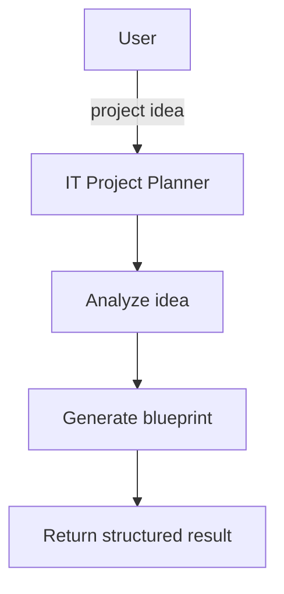
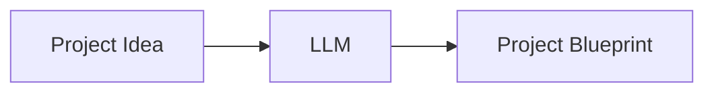
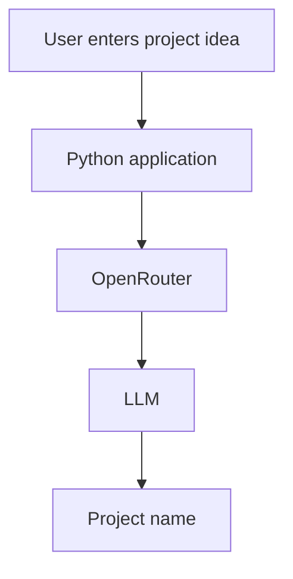
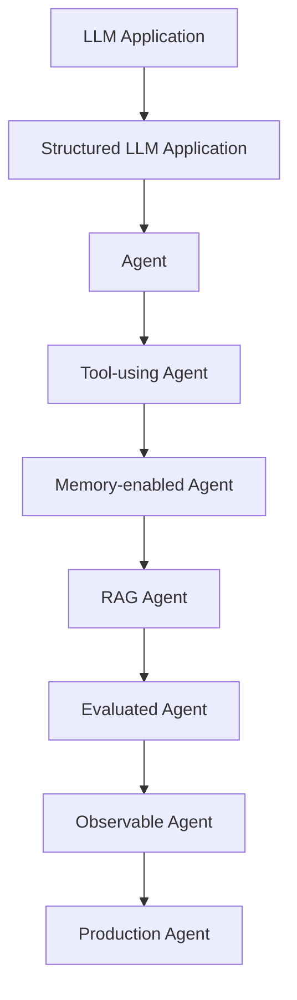
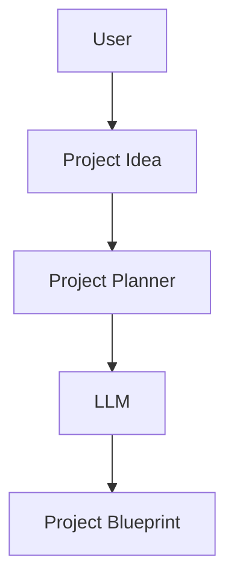
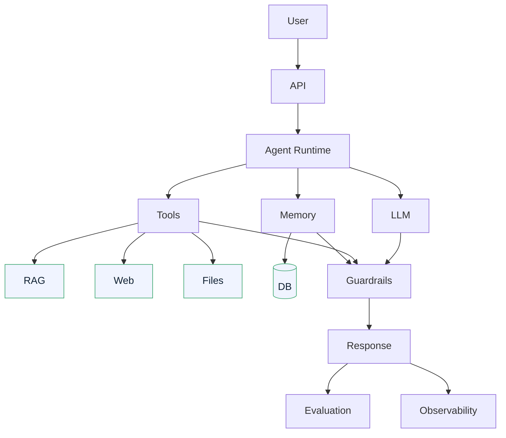

# IT Project Planner Agent — Product Requirements Document (PRD)

## 1. Product Overview

**Name:** IT Project Planner Agent

A person has an IT project idea but doesn't know how to turn that idea into a structured technical plan. The IT Project Planner Agent transforms a rough idea into a structured project blueprint.

### Example

Input:

> "I want to build an AI chatbot for company documents."

Output:

| Section | Content |
| --- | --- |
| Project Name | DocumentAI Assistant |
| Business Problem | Employees need to find information in company documents. |
| Requirements | - Upload documents - Search documents - Ask questions - Generate grounded answers |
| Technology Stack | - Python - FastAPI - PostgreSQL - pgvector - LLM - Docker |
| Implementation Plan | 1. Define requirements 2. Build ingestion pipeline 3. Build retrieval 4. Build generation 5. Add evaluation 6. Deploy |

## 2. Problem Statement

An IT project idea alone is not actionable. Non-technical stakeholders and engineers alike struggle to move from a vague idea to a concrete plan that names the requirements, the technology stack, and the order of work. This application removes that gap by generating a structured blueprint.

## 3. User Flow

The first version is deliberately a single, linear flow: idea in, blueprint out.

## 4. MVP Scope

The MVP is **not** an autonomous super-agent. It is an LLM application that maps a project idea to a project blueprint.

The blueprint must contain exactly:

1. **Project name**
2. **Project description**
3. **Business problem**
4. **Functional requirements**
5. **Non-functional requirements**
6. **Technology stack**
7. **Implementation plan**

### First milestone

An even smaller stepping stone comes first:

Example:

- Input: `"Build an AI system for employee knowledge."`
- Output: `"KnowledgeHub AI"`

We build this first, verify it, then expand section by section until the full blueprint is produced.

## 5. What Makes It an Agent (and What Doesn't, Yet)

Initially it is an **LLM application**, not an agent. We build it that way on purpose so the fundamental mechanics are understood before any framework or agentic behavior is layered on.

The intended evolution:

## 6. Architecture

### Phase 1 architecture

Not built yet, but where we are heading:

## 7. Technology Decisions

| Component | Technology | When |
| --- | --- | --- |
| Language | Python | Now |
| Package manager | uv | Now |
| Validation | Pydantic | Now |
| LLM | OpenRouter | Now |
| HTTP | httpx | Now |
| Testing | pytest | Now |
| Configuration | YAML + .env | Now |
| UI | TBD | Later |
| API | TBD | Later |
| Database | TBD | Later |
| RAG | rag-system | Later |
| Agent framework | None initially | Later |

### Key decision: no agent framework at the start

We implement the fundamental mechanics ourselves. This is how we will understand what agent frameworks actually do when we eventually use one.

## 8. Success Criteria

- [x] Idea in → structured blueprint out, with all seven required sections
- [x] First milestone reachable: idea in → project name out (as a `ProjectPlanner` service)
- [x] The system validates output structure with Pydantic (`ProjectName`; full `ProjectBlueprint` later)
- [x] The system is testable with pytest
- [x] Everything runs with `uv` and configuration from YAML + `.env`