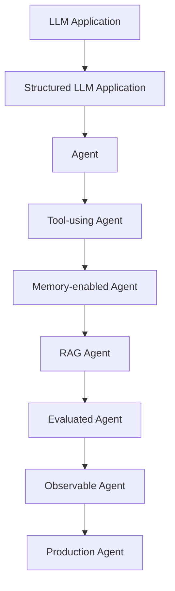
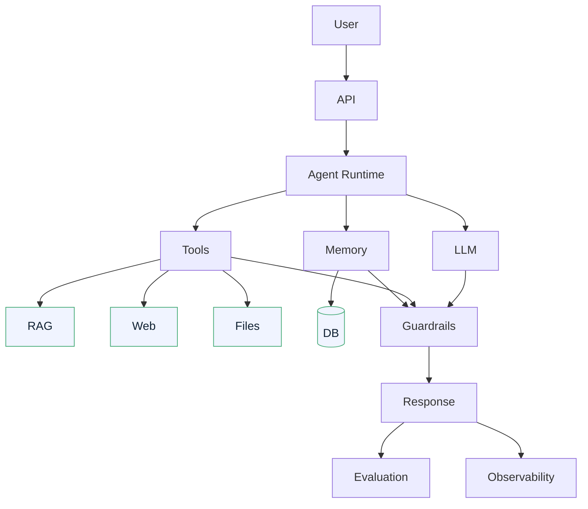

# IT Project Planner Agent — Roadmap

## How We Build This

We treat this as a **learning project**, not just a coding project. At every step we cover:

1. What we are building
2. Why it exists
3. The code
4. How to test it
5. What failure modes to watch for

Each phase is a small, verifiable milestone. We do not scaffold everything now.

## The Evolution Ladder

The project starts as a plain LLM application and evolves step by step toward a production agent:

The roadmap below maps phases to this ladder.

## Phases

### Phase 1 — Product & Requirements
- [x] Define the problem and user flow
- [x] Define the MVP (idea in → blueprint out)
- [x] Define what makes it an agent (and what doesn't yet)
- [x] Define the Phase 1 architecture
- [x] Choose technology decisions
- [x] Define the first milestone (idea → project name)
- [x] Write this PRD and roadmap

### Phase 2 — Project Setup
- Initialize Python project with `uv`
- Set up `pyproject.toml`, packages, tooling
- Set up YAML + `.env` configuration
- Configure `pytest`
- Verify the skeleton runs

### Phase 3 — LLM Client
- Minimal OpenRouter client using `httpx`
- Load an API key from config
- Single call: prompt in → text out
- First milestone test: `"Build an AI system for employee knowledge."` → `"KnowledgeHub AI"`
- Failure modes: missing key, network errors, timeouts, malformed responses

### Phase 4 — Prompt Management
- Move prompts out of code into templates
- Template loading and interpolation
- Versioning prompts
- Failure modes: unrendered variables, whitespace/format drift

### Phase 5 — Structured Output
- Define the `ProjectBlueprint` Pydantic model
- Validate model output, request JSON from OpenRouter
- Failure modes: missing keys, wrong types, truncated output

### Phase 6 — Project Planner
- The core service that wires idea → LLM → blueprint
- Populate all seven blueprint sections:
  1. Project name
  2. Project description
  3. Business problem
  4. Functional requirements
  5. Non-functional requirements
  6. Technology stack
  7. Implementation plan
- Failure modes: hallucinated stack choices, generic output, inconsistent plan

### Phase 7 — Agent Loop
- Introduce a loop: analyze idea → decide what is needed → call LLM → check result → iterate
- Move from single-shot LLM application to an agent runtime
- Failure modes: infinite loops, runaway token spend, no termination criteria

### Phase 8 — Tools
- Give the agent tools (e.g., web search, files)
- Tool-calling loop and structured tool requests
- Failure modes: bad tool args, tools returning junk, agent fabricating tool results

### Phase 9 — Memory
- Conversation memory and project-scoped state
- Short-term vs. long-term memory
- Failure modes: memory bloat, stale context, leakage across sessions

### Phase 10 — RAG
- Reuse the existing `rag-system`
- Retrieve relevant context to ground blueprint generation
- Failure modes: retrieval misses, irrelevant chunks, answer without grounding

### Phase 11 — Guardrails
- Input/output validation, prompt injection defense, topic scope control
- PII detection, output filtering
- Failure modes: prompt injection, harmful output, bypasses

### Phase 12 — Evaluation
- Golden datasets, structured evaluation of generated blueprints
- Metrics: correctness, completeness, format adherence
- Failure modes: evaluating on the dataset that prompted the prompt (overfitting the eval set)

### Phase 13 — Observability
- Tracing, logging of every LLM call, latency and cost tracking
- Failure modes: missing spans, PII in logs, noisy telemetry

### Phase 14 — API
- Wrap the planner in an HTTP API
- Request/response models, error handling, rate limiting
- Failure modes: unvalidated input, unbounded concurrency, leaking internal errors

### Phase 15 — UI
- Simple web UI for entering an idea and viewing a blueprint
- Failure modes: long-running requests without feedback, poor JSON rendering

### Phase 16 — Docker
- Containerize the application
- Failure modes: large images, secrets in image layers, non-hermetic builds

### Phase 17 — CI/CD
- Lint, type-check, and test on every change
- Automated deployment pipeline
- Failure modes: flaky tests, environment drift, unguarded deploys

### Phase 18 — Production
- Deployment target, secrets management, scaling, cost controls
- Monitoring, alerts, incident response
- Failure modes: silent failures, cost spikes, capacity surprises

## Target Architecture (End State)

Built incrementally across the phases above:

## Milestones

| # | Milestone | Phase |
| --- | --- | --- |
| M1 | Idea in → project name out | 3 |
| M2 | Idea in → full structured blueprint out | 5–6 |
| M3 | Multi-turn agent with planning | 7 |
| M4 | Agent with tools | 8 |
| M5 | Agent with memory | 9 |
| M6 | Agent grounded by RAG | 10 |
| M7 | Guarded, evaluated, observable agent | 11–13 |
| M8 | Exposed via API and UI | 14–15 |
| M9 | Containerized, CI/CD, running in production | 16–18 |

## Guiding Principles

- **No agent framework until the mechanics are built by hand.**
- Every phase ships a working, testable increment — never a bigger-than-can-be-verified blob.
- Understand *why* before *how*: each phase explains the motivation first.
- Failures are expected and documented; knowing what breaks is part of the learning outcome.